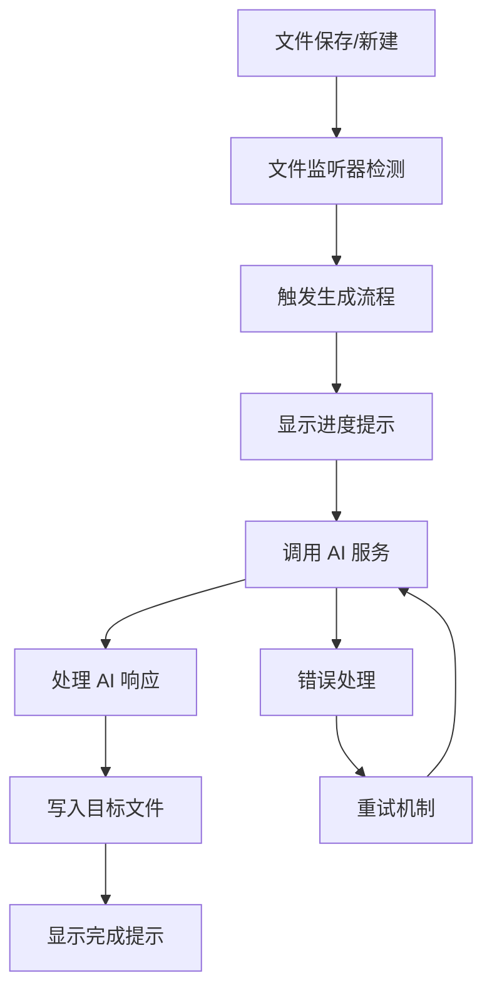

# LumosGen VS Code 插件 — 设计文档

## 1. 项目概述

### 1.1 项目愿景与命名由来

**LumosGen** 名称灵感来自拉丁语 `lumen`（意为"光"），与《哈利·波特》中"Lumos"魔咒——用来照亮黑暗之处——息息相关。插件的目标，是在知识工作与内容创作的"黑暗场景"中，**点亮智能生成内容的路径**。

"Gen" 表示生成（Generation）：结合"Lumos"，寓意"以智能之光照亮创作过程"，非常符合 AI Agent 驱动、内容生成的定位。

### 1.2 项目目标

- **目标用户**：研究人员、内容创作者和开发者
- **核心痛点**：在知识库或 Markdown 文件目录频繁变动时，手动创建概览、摘要或结构页面很耗时间，且容易遗漏关键内容
- **解决方案**：提供自动化的 AI 驱动内容生成，实现一键式智能内容创作

## 2. 核心功能设计

### 2.1 功能模块概览

#### 文件变动监测模块
- 使用 VS Code API `workspace.createFileSystemWatcher(...)` 监控目标文件夹
- 支持多种文件类型监控（.md, .txt, .json 等）
- 可配置的文件路径 glob 模式

#### AI 触发机制
支持两种调用方式：
1. **本地 HTTP 服务**：调用部署在本地的 FastAPI 或其他服务
2. **远程 AI 服务**：调用 OpenAI、Claude 或其他 AI 模型 API

#### 内容生成与写入
- AI 返回内容（章节摘要、目录、FAQ 结构等）
- 自动写入用户配置的目标文件（如 `README.md` 或 `OVERVIEW.md`）
- 支持多种生成模板和格式

#### 用户反馈与体验
- 状态栏实时反馈
- 提示框显示生成进度
- Output 面板详细日志
- 错误处理和重试机制

#### 配置中心
用户可在 `settings.json` 中配置：
- 监测文件类型与路径 glob
- AI 服务端点与鉴权信息
- 输出文件名/路径
- 触发延迟与选项

### 2.2 核心价值

- **自动化监听**：实时监测本地文件变动
- **智能生成**：AI Agent 驱动的内容生成
- **无缝集成**：与 VS Code 工作流完美融合
- **高度可配置**：灵活的配置选项满足不同需求

## 3. 技术架构设计

### 3.1 整体架构

```
LumosGen VS Code Extension
├── 文件监听层 (File Watcher)
├── AI 服务层 (AI Service)
├── 内容处理层 (Content Processor)
├── 配置管理层 (Configuration)
└── 用户界面层 (UI/UX)
```

### 3.2 项目结构

```
lumosgen/
├── src/
│   ├── extension.ts       # 插件入口与激活逻辑
│   ├── watcher.ts         # 文件变动监听模块
│   ├── aiClient.ts        # AI 调用支持模块
│   ├── writer.ts          # 内容写入工具模块
│   ├── config.ts          # 配置获取与校验模块
│   ├── templates/         # 生成模板目录
│   └── utils/             # 工具函数
├── package.json           # 插件配置和依赖
├── README.md             # 用户文档
├── CHANGELOG.md          # 版本更新日志
└── tsconfig.json         # TypeScript 配置
```

### 3.3 核心流程



## 4. 开发计划

### 4.1 开发里程碑

| 阶段 | 目标 | 功能特性 | 预期输出 |
|------|------|----------|----------|
| **MVP (PoC)** | 基础功能验证 | - 监测 `.md` 文件更新<br>- 固定模板生成<br>- 写入指定文件 | 可用的基础插件 |
| **阶段 2** | 配置化支持 | - 用户配置界面<br>- 多种 AI 端点支持<br>- 自定义输出路径 | 完整配置系统 |
| **阶段 3** | 模板丰富化 | - 多种生成模板<br>- 模板选择界面<br>- 自定义模板支持 | 灵活的模板系统 |
| **阶段 4** | 国际化与扩展 | - 多语言支持<br>- 多格式输出<br>- 插件市场发布 | 国际化产品 |
| **阶段 5** | 优化与维护 | - 性能优化<br>- 错误处理完善<br>- 单元测试覆盖 | 生产就绪版本 |

### 4.2 技术选型

- **开发语言**：TypeScript
- **框架**：VS Code Extension API
- **构建工具**：webpack/esbuild
- **测试框架**：Jest + VS Code Test Runner
- **代码规范**：ESLint + Prettier

## 5. API 设计

### 5.1 VS Code Extension API 使用

#### 文件监听
```typescript
const watcher = vscode.workspace.createFileSystemWatcher(
  new vscode.RelativePattern(workspaceFolder, '**/*.md')
);
```

#### 配置管理
```typescript
const config = vscode.workspace.getConfiguration('lumosGen');
const aiEndpoint = config.get<string>('aiEndpoint');
```

#### 用户反馈
```typescript
// 信息提示
vscode.window.showInformationMessage('LumosGen: 内容生成完成');

// 输出面板
const outputChannel = vscode.window.createOutputChannel('LumosGen');
outputChannel.appendLine('生成日志...');
```

### 5.2 AI 服务接口设计

```typescript
interface AIServiceRequest {
  prompt: string;
  template: string;
  context: FileContext[];
  options: GenerationOptions;
}

interface AIServiceResponse {
  content: string;
  metadata: {
    model: string;
    tokens: number;
    timestamp: string;
  };
}
```

## 6. 配置规范

### 6.1 插件配置项

```json
{
  "lumosGen.enabled": true,
  "lumosGen.watchPatterns": ["**/*.md", "**/*.txt"],
  "lumosGen.outputFile": "LumosGen-Summary.md",
  "lumosGen.aiService": {
    "type": "openai",
    "endpoint": "https://api.openai.com/v1/chat/completions",
    "apiKey": "${env:OPENAI_API_KEY}",
    "model": "gpt-4"
  },
  "lumosGen.templates": {
    "default": "summary",
    "available": ["summary", "toc", "changelog"]
  },
  "lumosGen.triggerDelay": 2000
}
```

## 7. 质量保证

### 7.1 测试策略
- **单元测试**：核心模块功能测试
- **集成测试**：VS Code API 集成测试
- **端到端测试**：完整工作流测试
- **性能测试**：大文件处理性能测试

### 7.2 错误处理
- AI 服务调用失败重试机制
- 网络异常处理
- 文件写入权限检查
- 配置验证和错误提示

## 8. 部署与发布

### 8.1 打包发布
- 使用 `vsce` 工具打包插件
- 发布到 VS Code Marketplace
- 提供离线安装包

### 8.2 版本管理
- 遵循语义化版本控制
- 维护详细的 CHANGELOG
- 支持自动更新检查

## 9. 未来扩展

### 9.1 高级功能
- 支持更多文件格式（PDF, DOCX）
- 集成版本控制系统
- 团队协作功能
- 插件生态系统

### 9.2 AI 能力扩展
- 多模态内容生成（图表、图片）
- 智能代码注释生成
- 文档翻译功能
- 内容质量评估

---

## 总结

**LumosGen** 是一个专注于智能内容生成的 VS Code 插件，通过 AI 驱动的自动化流程，为开发者和内容创作者提供高效的文档生成解决方案。插件设计遵循模块化、可配置、易扩展的原则，旨在成为内容创作工作流中不可或缺的智能助手。
